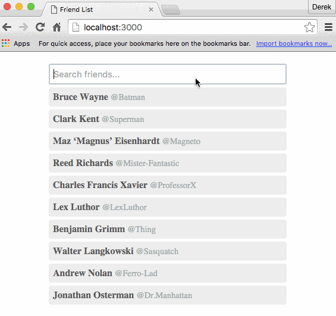

# Friend List
A non-trivial (yet simple) redux + react-router example problem.



## The Problem
Create an app with a dynamic and searchable list of data that keeps a search input text query in sync with the URL via a query parameter at all times. Assume the data will be fetched from some API and the API will perform the actual search. The query should be a simple string and kept in sync with the URL via a query parameter 'q' (ex. localhost:3000/?q=batman).

This problem is harder than it first appears, actions must be managed in the correct order, and if not can result in infinite loops and other undesirable behavior.

## The Spec
- Hit the API **once and only once** per query change.
- When the query updates -> update the URL and fetch results from the API.
- When the URL updates -> update the query and fetch results from the API.
- The browser's back / forward buttons should keep the app state (query + results) in sync with the URL (this is a gotcha if not thought about carefully).
- No optimizations (like caching previous queries) should be made, however the app should not be designed in a way that prevents this.

## Bonus Features
- Handle the concurrent actions issue (see the [redux-saga-solution](redux-saga-solution/), the [cyclejs-solution](cyclejs-solution/), and the [better-observable-solution](better-observable-solution/)) - "If the user changes the query input while there is still a pending request from a previous query change, the current pending request should be cancelled and a new request should be made." - Thanks [@yelouafi](https://github.com/yelouafi)
- Debounce the fetching of results by 100ms.
- Log any state changing action with the newly changed state.
- Add loading and/or error states (see the redux-meta-reducer [friend-list](https://github.com/DerekCuevas/redux-meta-reducer/tree/master/examples/friend-list) example).

## Solutions
Solutions are in their own subdirectories above. Check out the README files in each of the subdirectories for example specific details.

Many have similar structures (identical store state + hitting the same mock API). The difference being when and where the apps read router state and when and where the apps dispatch actions.

### To run
First clone the repo.

```sh
git clone https://github.com/DerekCuevas/friend-list.git
```

Then cd into an example, 'npm install' and 'npm start' to get going.

```sh
cd friend-list/imperative-solution/ # or the others
npm install
npm start
```

## Contributors
- [redux-saga-solution](redux-saga-solution/) - [@yelouafi](https://github.com/yelouafi)
- [cyclejs-solution](cyclejs-solution/) - [@justinwoo](https://github.com/justinwoo)
- [motorcyclejs-solution](motorcyclejs-solution/), [cyclejs-snabbdom-solution](cyclejs-snabbdom-solution/) - [@TylorS](https://github.com/TylorS)

#### Have a better implementation?
Please make an issue or send in a pull request.
